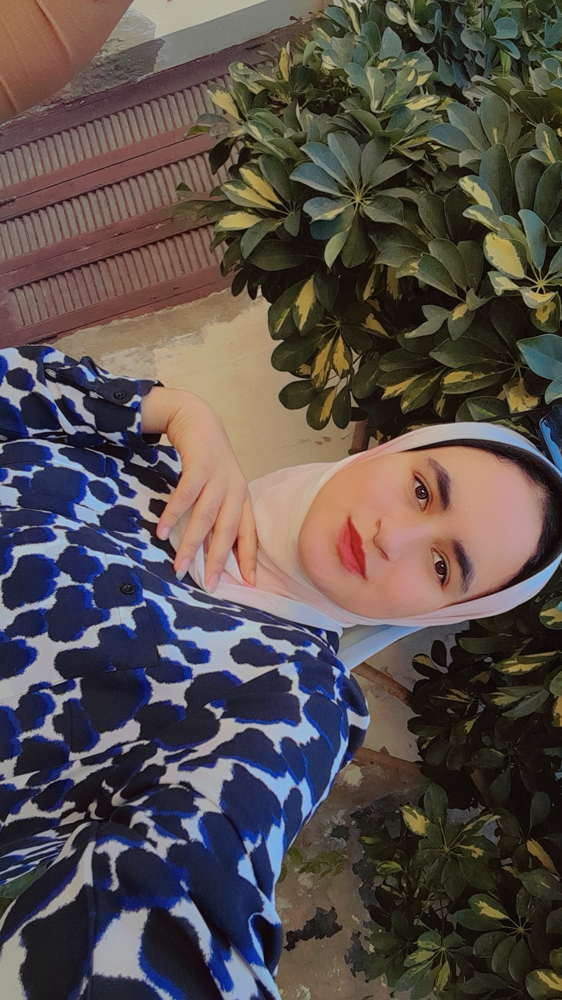

<!DOCTYPE html>
<html>
  <head>
 <title>cv</title> 
   
  </head>
  <body>
   <h1>cv</h1>

     
     

 <h2> name :mai mahrous saad</h2>      
   <h2>Governorate: kafr al shaykh</h2>    
      <h2>phone number :01008749793</h2> 
      

      <h3>about me</h3> 

       <h2> I am in a technical commercial institute and learning web pages."</h2>

     <h3>Languages</h3>
     

     <lo>
       <li>Arbic</li>
       <li>English </li>
     </lo>

     

    <h3>skills </h3> 
    

     <lo>
       <li>html</li>
       <li>css</li>
     </lo>
     

     

    
    
    
    
    

    
    
    
    
  </body>
  
  
  
  
  
  
  
  
  

</html>
